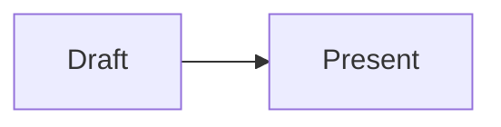

# Reveal.js Deck Authoring

Create practical, presentation-ready decks in the repository's remote format.
The platform fetches public Markdown from GitHub; it does not use a local
JavaScript build step for these decks.

## When to use

- Create a new presentation or deck folder.
- Add, reorder, or rewrite slides in `slides.md`.
- Add speaker notes, fragments, backgrounds, diagrams, video, or transitions.
- Configure `meta.json` for a deck's title, theme, publishing, or live-event timing.
- Diagnose missing metadata, broken assets, or malformed slide separators.

## Procedure

### 1. Inspect the repository

Find the target deck and read its `slides.md` and `meta.json` before editing.
Preserve the existing visual language and any user-authored content. If this is
a new deck, use the following shape:

```text
<deck-id>/
├── meta.json
└── slides.md
```

For multiple decks, place each folder under `decks/`. The repository must be
public and the published files must be on `main`.

### 2. Define metadata

Start with valid JSON and only add fields that are needed:

```json
{
  "title": "My Talk",
  "description": "Short landing-page description",
  "published": true,
  "theme": "black",
  "autoFragment": false
}
```

Valid themes are `black`, `white`, `league`, `beige`, `sky`, `night`, `serif`,
`simple`, `solarized`, `moon`, `dracula`, and `blood`. Dates must be ISO 8601
UTC strings. `availableFrom` controls when the deck appears, and
`selfExploreFrom` controls when followers may navigate independently.

### 3. Author Markdown slides

Use these structural rules:

- `---` on its own line starts a horizontal slide.
- `--` on its own line starts a vertical child slide.
- Put blank lines around separators.
- Put a `<!-- .slide: ... -->` comment on the first line for slide attributes.
- Put `Notes:` after visible content for speaker notes; use one notes block per slide.
- Use `<!-- .element: ... -->` for attributes on Markdown elements.
- Use stable slide IDs when the slide needs a shareable link.

Prefer clear slide hierarchy and one main idea per slide. Use fragments when
content should be revealed progressively, not merely to add movement.

### 4. Handle remote assets

Use absolute, publicly reachable URLs for images, videos, and background media.
Relative asset paths resolve against `slides.mightora.io`, so they generally do
not point into the GitHub repository. Raw GitHub and jsDelivr URLs are suitable
for repository assets.

Supported examples include:

````md
<!-- .slide: data-background-image="https://example.com/background.jpg" -->



````

Do not reference local files unless the deck is being previewed in a host that
provides those files.

### 5. Validate before finishing

Check all of the following:

- Every deck folder contains valid `meta.json` and `slides.md`.
- JSON parses successfully and the theme is one of the supported values.
- Slide separators are standalone and surrounded by blank lines.
- Notes are not accidentally placed before visible slide content.
- Remote images, videos, and background URLs are absolute.
- Mermaid and PlantUML fences use the exact language names.
- The README URL uses the correct owner, repository, and deck ID.
- The deck is reachable at `/r/<owner>/<repo>/<deck-id>/follower` after it is pushed.

There is no package install or local build command required for this template.
Use the included `platform-showcase/slides.md` as the feature reference when a
Reveal.js or platform behavior is uncertain.