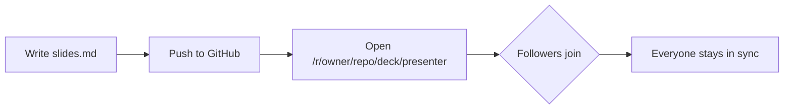
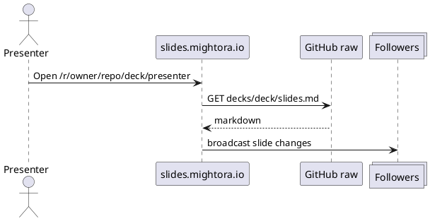

<!-- .slide: data-background-gradient="linear-gradient(135deg, #042f2e 0%, #0f766e 55%, #134e4a 100%)" -->
# Platform Showcase

### Every Reveal.js feature. Every slides.mightora.io feature.

One slide per feature, with the markdown that produced it.

Copy this deck to start your own: [mightora/slides-showcase](https://github.com/mightora/slides-showcase)

Notes:
Welcome. This deck is a living template. Every slide shows a feature and the exact markdown behind it, so presenters can copy what they need. Press the arrow keys, or the on-screen controls, to move. Down arrows mean there is a vertical child slide with more detail.

---

## How to read this deck

- **Right arrow** moves to the next topic
- **Down arrow** opens extra detail under a topic
- Every slide is authored in a single `slides.md`
- Look for the `md` code blocks: that is the source for what you see

Press **S** in presenter mode for the speaker view. Press **?** for all Reveal.js keyboard shortcuts.

Notes:
Reveal shortcuts: arrows navigate, Space advances, F is fullscreen, O is overview, B blanks the screen, S opens the speaker window, and ? shows the help panel.

---

<!-- .slide: id="getting-started" -->
## Getting started: bring your own slides

Put two files in a **public GitHub repo** on the `main` branch:

```text
your-repo/
└── decks/
    └── my-first-talk/
        ├── meta.json
        └── slides.md
```

Then open:

```text
https://slides.mightora.io/r/<owner>/<repo>/my-first-talk/follower
https://slides.mightora.io/r/<owner>/<repo>/my-first-talk/presenter
```

Notes:
The folder name becomes the deck id in the URL. Deck ids should be lowercase letters, numbers and hyphens. Presenter mode is protected by the platform's presenter password; follower mode is open.

--

### Remote deck rules

| Rule | Why |
| --- | --- |
| Repo must be public, branch must be `main` | Slides are fetched from `raw.githubusercontent.com` |
| Only `slides.md` is supported remotely | `slides.html` is only for decks hosted on the platform |
| Use absolute URLs for your own images and videos | Relative paths resolve against slides.mightora.io, not your repo |
| Sync room is `owner/repo/deck-id` | Presenter and followers on the same URL stay in sync |

Absolute asset URL example:

```text
https://raw.githubusercontent.com/<owner>/<repo>/main/decks/my-first-talk/hero.png
```

Notes:
If you need faster asset delivery, jsDelivr also serves GitHub files: https://cdn.jsdelivr.net/gh/owner/repo@main/path/to/file.png

--

### Slide separators

```md
# Slide one
---
## Slide two
--
### Vertical child of slide two
```

- A line containing only `---` (with blank lines around it) starts a new **horizontal** slide
- A line containing only `--` starts a **vertical** child slide
- A line starting with `Notes:` begins speaker notes for the current slide

Notes:
Only one Notes block per slide. Everything after it, until the next separator, is treated as speaker notes and hidden from the audience.

---

<!-- .slide: id="meta-json" -->
## meta.json reference

```json [2-3|4|5|6|7-8|9-10|11-13]
{
  "title": "My First Talk",
  "description": "Shown on the landing page",
  "published": true,
  "theme": "black",
  "autoFragment": false,
  "availableFrom": "2026-06-15T09:00:00Z",
  "selfExploreFrom": "2026-06-15T17:00:00Z",
  "videoPlaybackRate": 1.4,
  "videoBackgroundSize": "contain",
  "defaultBackground": {
    "gradient": "linear-gradient(135deg, #0f172a, #1e293b)"
  }
}
```

Step through the highlights to see each field.

Notes:
title and description feed the landing page card. published false hides the deck from the list but keeps it reachable by URL. theme picks one of the twelve Reveal themes. autoFragment turns every list item into a click-to-reveal fragment. availableFrom and selfExploreFrom control the live-event phases. videoPlaybackRate speeds up every video element. videoBackgroundSize is the object-fit for background videos. defaultBackground applies to any slide that does not set its own background; it accepts image, color, gradient, video, size, opacity, position and repeat.

--

### Availability phases

| Phase | Landing page | Followers | Presenter |
| --- | --- | --- | --- |
| Before `availableFrom` | Hidden | Blocked | Password |
| Between `availableFrom` and `selfExploreFrom` | "Live Event" badge | Locked to presenter's slide | Password |
| After `selfExploreFrom` (or neither set) | Listed | Free to explore | Password |

Dates are ISO 8601 in UTC, for example `2026-06-15T09:00:00Z`.

Notes:
During a live event followers cannot skip ahead of the presenter. Once selfExploreFrom passes, anyone can browse the deck at their own pace. If you set neither field, the deck is fully open immediately.

--

### Themes

`black` · `white` · `league` · `beige` · `sky` · `night` · `serif` · `simple` · `solarized` · `moon` · `dracula` · `blood`

```json
{ "theme": "dracula" }
```

This deck uses `black` with a `defaultBackground` gradient layered on top.

Notes:
Pick a theme that matches your room lighting. Dark themes work well on projectors; white or simple are better for bright rooms and screen sharing.

---

## Speaker notes

This slide has notes. Presenters see them in the **Show notes** panel and in the speaker view.

```md
## Speaker notes

Visible slide content goes here.
```

...followed by a line that starts with `Notes:` and then your notes.

Notes:
These are the notes for this slide. Timing cue: about 30 seconds. Notes are also pushed to the follower sync channel so the speaker view stays in step with the main screen.

---

## Fragments

- Appears first <!-- .element: class="fragment" -->
- Then this one <!-- .element: class="fragment" -->
- Finally this one <!-- .element: class="fragment" -->

```md
- Appears first <!-- .element: class="fragment" -->
- Then this one <!-- .element: class="fragment" -->
```

Notes:
The .element comment applies attributes to the markdown element it follows. Fragments are synced to followers, so when you reveal a bullet the audience sees it too.

--

### Fragment styles

- fade-up <!-- .element: class="fragment fade-up" -->
- fade-left <!-- .element: class="fragment fade-left" -->
- grow <!-- .element: class="fragment grow" -->
- shrink <!-- .element: class="fragment shrink" -->
- strike <!-- .element: class="fragment strike" -->
- highlight-red <!-- .element: class="fragment highlight-red" -->
- highlight-blue <!-- .element: class="fragment highlight-blue" -->
- fade-in-then-out <!-- .element: class="fragment fade-in-then-out" -->
- fade-in-then-semi-out <!-- .element: class="fragment fade-in-then-semi-out" -->

Notes:
Other styles: fade-out, fade-down, fade-right, semi-fade-out, current-visible, highlight-green, highlight-current-red, highlight-current-green, highlight-current-blue.

--

### Fragment order

- Shown third <!-- .element: class="fragment" data-fragment-index="3" -->
- Shown first <!-- .element: class="fragment" data-fragment-index="1" -->
- Shown second <!-- .element: class="fragment" data-fragment-index="2" -->

```md
- Shown third <!-- .element: class="fragment" data-fragment-index="3" -->
- Shown first <!-- .element: class="fragment" data-fragment-index="1" -->
```

Notes:
data-fragment-index lets you control reveal order independently of document order. Items sharing an index appear together.

--

### Platform: autoFragment

Set `"autoFragment": true` in `meta.json` and **every** list item becomes a fragment without any markup.

Opt a single list out with the `no-fragment` class:

```md
- Shown immediately
- Also shown immediately
<!-- .element: class="no-fragment" -->
```

Notes:
autoFragment is ideal for workshop decks where you want to pace every bullet. Use no-fragment on agendas or reference lists that should appear all at once.

---

<!-- .slide: data-background-color="#7c2d12" -->
## Background colour

```md
<!-- .slide: data-background-color="#7c2d12" -->
## Background colour
```

Slide attributes go in a `.slide:` comment on the **first line** of the slide.

Notes:
Any Reveal data-attribute can be set this way: backgrounds, transitions, auto-animate, ids and visibility.

--

<!-- .slide: data-background-gradient="radial-gradient(circle at 30% 20%, #f59e0b, #7c2d12 60%, #1c1917)" -->
### Background gradient

```md
<!-- .slide: data-background-gradient="radial-gradient(circle at 30% 20%, #f59e0b, #7c2d12 60%, #1c1917)" -->
```

Notes:
Linear, radial and conic gradients all work; it is passed straight to CSS.

--

<!-- .slide: data-background-image="/examples/mesh-background.svg" data-background-size="cover" data-background-opacity="0.45" -->
### Background image

```md
<!-- .slide: data-background-image="/examples/mesh-background.svg"
     data-background-size="cover"
     data-background-opacity="0.45" -->
```

Also available: `data-background-position`, `data-background-repeat`.

Notes:
Remember that for remote decks the image URL must be absolute, pointing at your repo or a CDN.

--

<!-- .slide: data-background-video="https://interactive-examples.mdn.mozilla.net/media/cc0-videos/flower.mp4#t=3" data-background-video-loop data-background-video-muted="true" data-background-opacity="0.6" -->
### Background video

```md
<!-- .slide: data-background-video="https://example.com/clip.mp4#t=3"
     data-background-video-loop
     data-background-video-muted="true"
     data-background-opacity="0.6" -->
```

**Platform extras:** `#t=3` starts playback at 3 seconds (also on loop); `videoBackgroundSize` in `meta.json` or `data-background-size="contain"` stops edges being cropped.

Notes:
The time offset supports seconds, mm:ss and hh:mm:ss. videoPlaybackRate from meta.json applies here too.

--

<!-- .slide: data-background-iframe="/wifi?ssid=Conference-Guest&password=slides2026" -->
### Background iframe

```md
<!-- .slide: data-background-iframe="/wifi?ssid=Conference-Guest&password=slides2026" -->
```

Any embeddable page works. This one is the platform's own **Wi-Fi QR utility**.

Notes:
Add data-background-interactive if the audience should be able to click inside the iframe. Many third-party sites block embedding, so test first.

--

### Platform: defaultBackground

Every slide in this deck **without** its own background gets this from `meta.json`:

```json
"defaultBackground": {
  "gradient": "linear-gradient(135deg, #0f172a 0%, #1e293b 100%)"
}
```

Supported keys: `image`, `color`, `gradient`, `video`, `size`, `opacity`, `position`, `repeat`.

Notes:
Great for a branded backdrop. Any slide that sets data-background-color, image, video, gradient or iframe overrides it.

---

<!-- .slide: data-transition="zoom" data-background-transition="fade" data-background-color="#4c1d95" -->
## Transitions

```md
<!-- .slide: data-transition="zoom" data-background-transition="fade" -->
```

Slide transitions: `none` · `fade` · `slide` · `convex` · `concave` · `zoom`

Split in/out: `data-transition="slide-in fade-out"`

Notes:
The deck default is slide. Set per-slide transitions sparingly; zoom works well for section openers.

---

<!-- .slide: data-auto-animate -->
## Auto-animate

- Step one

```md
<!-- .slide: data-auto-animate -->
## Auto-animate
- Step one
```

Notes:
Two consecutive slides with data-auto-animate. Reveal matches elements by content and animates the differences. Press right to see it.

---

<!-- .slide: data-auto-animate -->
## Auto-animate

- Step one
- Step two appears
- Step three slides in

```md
<!-- .slide: data-auto-animate -->
## Auto-animate
- Step one
- Step two appears
- Step three slides in
```

Notes:
Matching headings and bullets moved smoothly, new bullets faded in. Use data-id attributes on HTML elements when you need explicit matching.

---

## Code with step-through highlights

```js [1-2|4-7|9]
const owner = 'your-github-user';
const repo = 'your-slides-repo';

function followerUrl(deckId) {
  const base = 'https://slides.mightora.io/r';
  return `${base}/${owner}/${repo}/${deckId}/follower`;
}

console.log(followerUrl('my-first-talk'));
```

````md
```js [1-2|4-7|9]
const owner = 'your-github-user';
```
````

Notes:
The bracket after the language sets data-line-numbers. Pipe-separated ranges become fragments, so you step through the highlights with the arrow keys and followers stay in sync.

---

## Mermaid diagrams



Write a fenced code block with the language set to `mermaid` and the diagram source inside.

Notes:
Flowcharts, sequence diagrams, class diagrams, Gantt charts, pie charts and more. Diagrams render when the slide is shown so hidden slides do not produce zero-size SVGs.

---

## PlantUML diagrams



Write a fenced code block with the language set to `plantuml`.

Notes:
PlantUML is rendered through the platform's proxy to a PlantUML server, so it works for remote decks too.

---

## Embedded video

<video controls muted playsinline preload="metadata" style="width:min(70vw, 820px); border-radius:14px; box-shadow:0 18px 38px rgba(0,0,0,0.4);">
  <source src="https://interactive-examples.mdn.mozilla.net/media/cc0-videos/flower.mp4" type="video/mp4" />
</video>

Inline HTML `<video>` tags work in markdown. `videoPlaybackRate` in `meta.json` applies to every video (this deck uses `1`).

Notes:
Recorded demos are safer than live ones. Set videoPlaybackRate to 1.4 or 1.5 to keep recorded demos moving.

---

## Text content

| Markdown | Renders as |
| --- | --- |
| `**bold**` | **bold** |
| `*italic*` | *italic* |
| `` `code` `` | `code` |
| `[link](https://mightora.io)` | [link](https://mightora.io) |

> Blockquotes are great for a single big idea.

<div style="margin-top:1rem; padding:0.6rem 1rem; border-left:4px solid #34d399; background:rgba(52,211,153,0.12); text-align:left;">
  Inline HTML is allowed whenever markdown is not enough.
</div>

Notes:
GitHub-flavoured markdown tables, quotes, emphasis, links and images all work. Drop into HTML for layout or styling.

---

## Images

 <!-- .element: style="max-width:420px; background:#fff; padding:1rem; border-radius:12px;" -->

```md
 <!-- .element: style="max-width:420px" -->
```

Notes:
Use .element to size or style an image. For remote decks the src must be an absolute URL.

---

## Layout helpers

<h2 class="r-fit-text">FIT TEXT</h2>

```html
<h2 class="r-fit-text">FIT TEXT</h2>
```

`r-fit-text` scales text to fill the slide width.

Notes:
Reveal ships a few layout utility classes. This one is perfect for one-word punchline slides.

--

### r-stack

<div class="r-stack">
  <div class="fragment fade-out" data-fragment-index="0" style="width:420px; height:180px; background:#2563eb; border-radius:16px; display:flex; align-items:center; justify-content:center;">Layer 1</div>
  <div class="fragment current-visible" data-fragment-index="0" style="width:360px; height:180px; background:#16a34a; border-radius:16px; display:flex; align-items:center; justify-content:center;">Layer 2</div>
  <div class="fragment" style="width:300px; height:180px; background:#dc2626; border-radius:16px; display:flex; align-items:center; justify-content:center;">Layer 3</div>
</div>

```html
<div class="r-stack">
  <div class="fragment fade-out" data-fragment-index="0">Layer 1</div>
  <div class="fragment current-visible" data-fragment-index="0">Layer 2</div>
  <div class="fragment">Layer 3</div>
</div>
```

Notes:
r-stack places children on top of each other. Combine with fragments to swap content in place.

--

### r-hstack and r-vstack

<div class="r-hstack" style="gap:1rem;">
  <div style="padding:1rem 1.5rem; background:#1e40af; border-radius:12px;">Left</div>
  <div style="padding:1rem 1.5rem; background:#047857; border-radius:12px;">Centre</div>
  <div style="padding:1rem 1.5rem; background:#b91c1c; border-radius:12px;">Right</div>
</div>

```html
<div class="r-hstack">
  <div>Left</div><div>Centre</div><div>Right</div>
</div>
```

`r-hstack` lays children out horizontally, `r-vstack` vertically.

Notes:
These are flexbox wrappers so you can add gap or alignment styles inline.

--

### r-stretch


```html

```

Notes:
r-stretch makes an element fill the remaining vertical space on the slide. It must be a direct child of the slide.

---

<!-- .slide: id="linking" -->
## Slide IDs and links

```md
<!-- .slide: id="meta-json" -->
## meta.json reference
```

Then link to it from anywhere: [Jump back to meta.json](#/meta-json)

Hide a slide from the count with `data-visibility="uncounted"`, or skip it entirely with `data-visibility="hidden"`.

Notes:
Named slides give you stable URLs, so you can share a link to a specific slide even after reordering the deck.

---

<!-- .slide: data-background-gradient="linear-gradient(135deg, #1e1b4b 0%, #312e81 100%)" -->
## Platform: presenter tools

Log in as presenter and the HUD gives you:

- **Controls** panel: messages, whiteboard, follower permissions
- **Followers** count and the list of who is in the room
- **Open speaker view** with notes, timer and next slide
- **Show notes** inline
- **Break** overlay with countdown and rejoin QR
- **Sign out**

Notes:
All of these work for remote decks too. The presenter password is set by the platform owner; ask for it before your session.

--

### Live sync and the join card

- The **first slide** in presenter mode shows a QR code and the follower URL
- Followers automatically move with you, fragments included
- During a live event followers cannot skip ahead
- After `selfExploreFrom`, followers get their own controls

Notes:
Put the join card up while people arrive. Each follower is given a fun random name so you can see the room fill up in the followers list.

--

### Messages

Send a text and/or a link to every follower at once.

- Polls and surveys
- Exercise instructions
- Documentation links

Followers see an overlay with an **Open link** button and can dismiss it.

Notes:
Open Controls, then Send Message. The message stays until each follower dismisses it.

--

### Whiteboard

A full **Excalidraw** whiteboard synced to every follower.

- View-only by default
- Toggle **Allow followers to draw** for collaboration
- Stays open across slides until you close it

Notes:
Useful for brainstorming or when a question needs a quick sketch. Only the presenter can close it.

--

### Break overlay

Click **Break** on the HUD to show a countdown and the rejoin QR code on every screen.

Followers see the same overlay so they know exactly when to be back.

Notes:
Pick the return time and go. The overlay closes for everyone when you end the break.

--

### Speaker view and remote

- **Speaker view** opens a second window with current slide, next slide, notes and timer
- **Presenter remote** lets you drive the deck from your phone

```text
https://slides.mightora.io/deck/<deck-id>/speaker
https://slides.mightora.io/deck/<deck-id>/remote
```

Notes:
Speaker view and the phone remote are available for decks hosted on the platform itself.

---

## Platform: utilities

Two standalone tools live on the home page and work without a deck:

| Utility | URL |
| --- | --- |
| Countdown timer | `/timer?target=14:30` |
| Wi-Fi QR code | `/wifi?ssid=Guest&password=secret` |

Open them on a spare screen, or embed them as a background iframe like the earlier slide.

Notes:
The timer is high-contrast and designed to be readable from the back of the room.

---

<!-- .slide: data-background-gradient="linear-gradient(135deg, #042f2e 0%, #0f766e 55%, #134e4a 100%)" -->
## Your checklist

1. Create `decks/<deck-id>/meta.json` and `slides.md` in a public repo
2. Push to `main`
3. Open `/r/<owner>/<repo>/<deck-id>/presenter`
4. Share the follower QR from the first slide
5. Present

Copy this deck: [mightora/slides-showcase on GitHub](https://github.com/mightora/slides-showcase)

Notes:
That is everything. Fork the showcase, delete the slides you do not need, and keep the ones that show the features you want.

---

<!-- .slide: data-visibility="uncounted" -->
## Appendix: troubleshooting

| Symptom | Fix |
| --- | --- |
| "metadata not found" | Check `decks/<deck-id>/meta.json` exists on `main` and the repo is public |
| Images missing | Use absolute URLs for remote decks |
| Slides merge together | Put blank lines above and below `---` |
| Notes show on screen | Only one `Notes:` line per slide |
| Diagram blank | Check the fenced block language is exactly `mermaid` or `plantuml` |

This slide uses `data-visibility="uncounted"`, so it is not included in the progress bar.

Notes:
Keep this slide at the end as a quick reference when things go wrong on stage.
